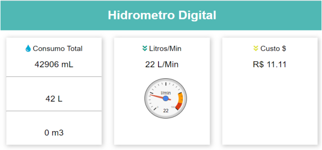
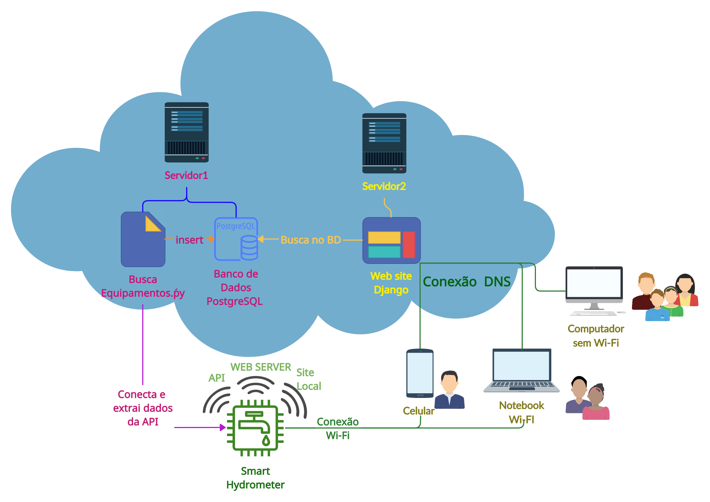

# Smart Hidrometer

This repository presents an academic new version of a low-cost project that aims to assist a human task using the Internet of Things (IoT) for sustainable development. It is a smart digital water meter that calculates water consumption using an ESP board, also known as an Arduino with the 8266 chipset, in order to inform the user of water consumption in liters and the cost in Brazilian reais based on the real-time tariffs of the water utility. The consumption measurements, along with the tariff calculations, are presented to the user through a global website developed in Python using the Django framework, where queries can be made for each specific water meter, a local website connected to the user's internal network, and a 1.3-inch OLED display. This communication between the water meter and the user aims to provide better control over water consumption in homes and businesses, with the expectation of resulting in positive financial and environmental impacts.

## Hardware

The components are:
 - ESP NodeMCU
 - Water Flow Sensor
 - 1.3-inch OLED display

### Schematic Diagram
Here is a figure to demonstrate a diagram model of the project.

## Software

There are 3 ways to access the data meters:
- Display OLED;
- Local Web server on the ESP Board;
- Global Website.

### Local Web Server View:

### Global Website Dashboard:

### Macro Views of the project:

## More

More about project in topic 'HIDRÔMETRO INTELIGENTE' on page 35 of this link: https://www.vemprafam.com.br/wp-content/uploads/2023/08/Vol.-16-No.-1-2023.pdf
